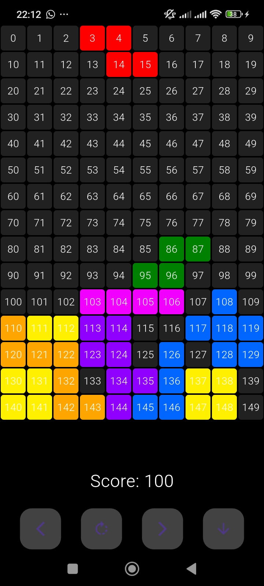

Okay, let's craft a GitHub README for your Flutter Tetris game. I'll make some assumptions about the project name and basic features, but feel free to provide more details as requested in my previous message to make it even more accurate.

-----

# Flutter Tetris

## 🚀 Overview

A classic Tetris game meticulously crafted with Flutter, offering a smooth and engaging gameplay experience. Relive the timeless challenge of fitting falling blocks and clearing lines directly on your mobile device\!


## 📱 Screenshots

<div align="center">
  <div style="display: flex; flex-direction: row;">
    

  </div>

  <p><em>Mobile Experience</em></p>
</div>

## ✨ Features

* **Classic Gameplay:** Enjoy the core mechanics of Tetris – falling blocks, rotating, and clearing lines.
* **Intuitive Controls:** Simple touch-based controls for moving left, right, rotating, and fast-dropping pieces.
* **Score Tracking:** Keep track of your high score as you clear lines.
* **Game Over Screen:** A clear indication when the game ends, with an option to restart.
* **Responsive UI:** Adapts to various screen sizes for a consistent experience.
* **Built with Flutter:** Leveraging Flutter's powerful UI toolkit for a beautiful and performant game.

## 📸 Screenshots

*(Once you have screenshots, replace this placeholder with image embeds.)*

## 🛠️ Technologies Used

* **Flutter:** Google's UI toolkit for building natively compiled applications for mobile, web, and desktop from a single codebase.
* **Dart:** The programming language used by Flutter.

## ⚡ Getting Started

Follow these instructions to get a copy of the project up and running on your local machine for development and testing purposes.

### Prerequisites

* [Flutter SDK](https://flutter.dev/docs/get-started/install) (Ensure you have a stable version installed)
* A code editor like [VS Code](https://code.visualstudio.com/) or [Android Studio](https://developer.android.com/studio)

### Installation

1.  **Clone the repository:**

    ```bash
    git clone https://github.com/YOUR_USERNAME/YOUR_REPO_NAME.git
    cd YOUR_REPO_NAME
    ```

    *(Replace `YOUR_USERNAME` and `YOUR_REPO_NAME` with your actual GitHub username and repository name.)*

2.  **Install dependencies:**

    ```bash
    flutter pub get
    ```

3.  **Run the application:**

    ```bash
    flutter run
    ```

    This will launch the app on your connected device or emulator.

## 🕹️ How to Play

* **Move Left:** Tap the left arrow button.
* **Move Right:** Tap the right arrow button.
* **Rotate:** Tap the rotate button.
* **Fast Drop:** Tap the down arrow button to instantly drop the piece.
* **Clear Lines:** Align full rows of blocks horizontally to clear them and earn points.
* **Game Over:** The game ends when a piece stacks up to the top of the game board.

## 🛣️ Future Enhancements (Optional)

* **Level Progression:** Increase difficulty as the score grows.
* **Next Piece Preview:** Show the upcoming Tetromino.
* **Hold Piece:** Implement the ability to hold a piece for later use.
* **Sound Effects & Music:** Enhance the gaming experience with audio.
* **High Score Saving:** Persist high scores locally or online.
* **More Complex Rotation:** Implement full SRS (Super Rotation System) for more accurate Tetris mechanics.

-----